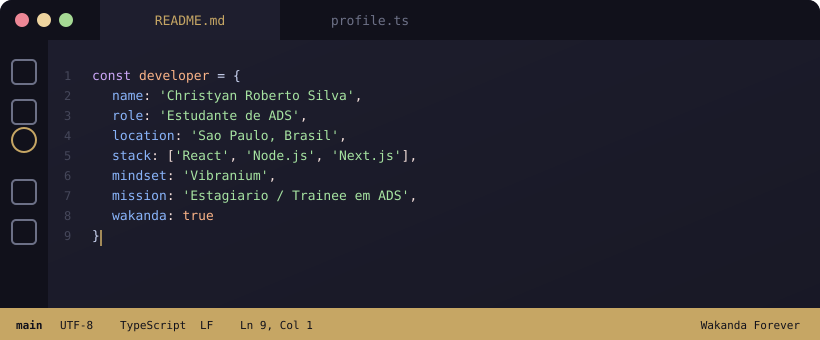
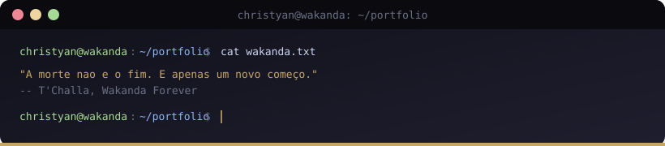

<div align="center">



</div>

<br>

<!-- Sobre mim -->

## `// Sobre mim`

```typescript
const developer = {
  nome: "Christyan Roberto Silva",
  idade: 20,
  formacao: "Analise e Desenvolvimento de Sistemas - Senac Santo Amaro (2024-2026)",
  localizacao: "Sao Paulo, Brasil",
  cargo_atual: "Controlador de CCO - Move Bus (desde 11/2025)",
  stack: ["React", "Node.js", "Next.js", "TypeScript", "Vite"],
  cursos_concluidos: "25+ (Alura, Cisco, SENAI)",
  ingles: "Intermediario",
  objetivo: "Estagiario / Trainee em Desenvolvimento de Sistemas",
  mindset: "Vibranium",
  wakanda: true,
};
```

> *"Um homem sabio comeca a construir sua defesa antes que a guerra estoure."*  
> -- Rei T'Chaka

Assim como o **Vibranium**, moldo cada linha de codigo com proposito e precisao. Construindo projetos web reais com React, Node.js e Next.js, me preparando para minha primeira oportunidade como estagiario ou trainee em desenvolvimento.

---

<!-- Stack -->

## `// Tech Stack`

<table>
<tr>
<td valign="top" width="50%">

### Frontend


</td>
<td valign="top" width="50%">

### Backend & Tools


</td>
</tr>
</table>

<sub>Componentizacao - Manipulacao de DOM e Arrays (map/filter/reduce) - Gerenciamento de Estado (useState/useEffect) - Requisicoes a API (Fetch, Axios, async/await) - localStorage - Logica de Programacao</sub>

---

<!-- Experiencia e Formacao -->

## `// Trajetoria`

<table>
<tr>
<th width="33%" align="left">Formacao</th>
<th width="33%" align="left">Experiencia</th>
<th width="33%" align="left">Certificacoes</th>
</tr>
<tr>
<td valign="top">

**Analise e Desenvolvimento de Sistemas**  
Senac Santo Amaro  
Em andamento (2024 - 2026)

Tecnico em Marketing  
Etec (2021 - 2023)

</td>
<td valign="top">

**Controlador de CCO**  
Move Bus  
Desde 11/2025

**Jovem Aprendiz ADM**
Potenza Engenharia  
1 ano e 4 meses

</td>
<td valign="top">

Alura  
Cisco Networking Academy  
SENAI  

25+ cursos concluidos em logica, JS, HTML/CSS, React, Git e IA generativa

</td>
</tr>
</table>

---

<!-- Contato -->

## `// Contato`

```bash
# Conecte-se comigo
$ git remote add origin https://github.com/christyan2311
```

<a href="https://wa.me/5511949970283" target="_blank"></a>
<a href="https://www.linkedin.com/in/christyan-roberto-53951b266" target="_blank"></a>
<a href="mailto:christyanroberto31@gmail.com" target="_blank"></a>
<a href="https://github.com/christyan2311" target="_blank"></a>

<br><br>

<div align="center">



</div>

---

<sub align="center">Isaias 41:13 - Wakanda Forever</sub>
